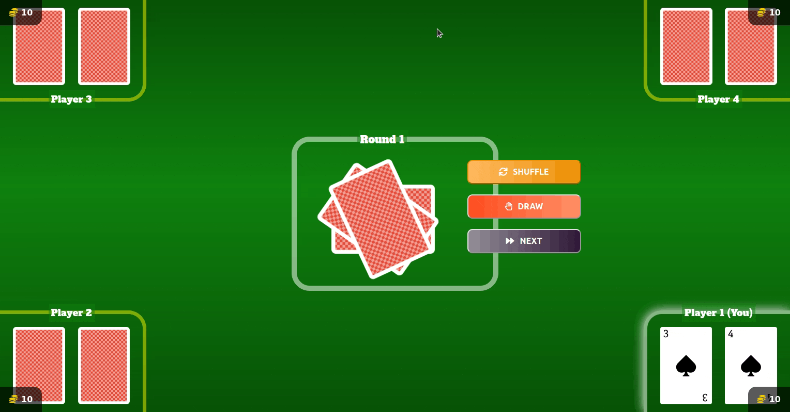
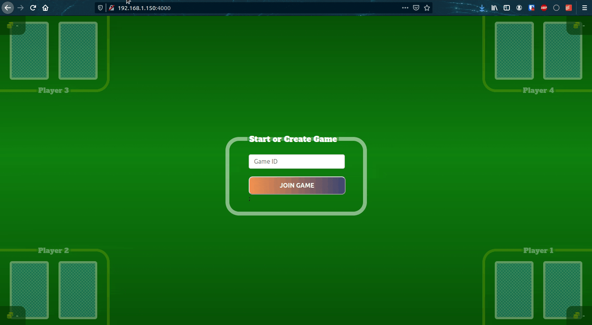

# ♦️ ♣ ❤️ ♠ Bust It!



Bust It is a web card game similar to [Blackjack](https://en.wikipedia.org/wiki/Blackjack) consisting of a maximum of 4 players and minimum of 2 players.

The rules are as follows:

1. For each turn the player has the option to shuffle the cards, draw an additional or skip their turn. The round is completed if all active players have completed their turn.

2. The player wins automatically if their cards totals up to 21.

    > **Winnings Calculation for each Round**
    >
    > **💰💰 Perfect Score Scenario (> 1 winners)**
    > - Player A: 21 (+2 chips)
    > - Player B: 21 (+2 chips)
    > - Player C: 18 (-1 chips)
    > - Player D: 25 (-1 chips)
    >
    >
    > **💰💰📈 Perfect Score Scenario (1 winner)**
    > - Player A: 21 (+2 +3 chips)
    > - Player B: 20 (-1 chips)
    > - Player C: 18 (-1 chips)
    > - Player D: 26 (-1 chips)
    >
    >
    > **💰 Highest Score Scenario (> 1 winners)**
    > - Player A: 20 (+1 chips)
    > - Player B: 18 (-1 chips)
    > - Player C: 20 (+1 chips)
    > - Player D: 27 (-1 chips)
    >
    > **💰📈 Highest Score Scenario (1 winner)**
    > - Player A: 20 (+1 +2 chips)
    > - Player B: 19 (-1 chips)
    > - Player C: 22 (-1 chips)
    >
    > **Fold Score Scenario (0 winners)**
    > - Player A: 22 (-0 chips)
    > - Player B: 26 (-0 chips)
    >
    > ------
    > **After every round,**
    > 
    > 1. If there are players that obtained a perfect 21, they are counted as winners and the rest as losers. They win 2 chips.
    > 2. Else if there are players that obtained the closest score to 21 and has not busted (over 21), they will win. The players wins 1 chip.
    > 3. If there is only 1 winner, the winner gets all losing active chips.
    > 4. If there is only 1 active player during the game in occasion that players leaves the game, the sole active player is consider the winner.
    > 5. Inactive players are not factored in the winnings calculation and counted void.
    > 6. If there are no winners, no chips are deducted.

3. Once all the active users chips have been exhausted, the game ends.

## Getting Started



Firstly, you will need to host the app on your computer locally.

> For remote setup, you may modify the `__main__.py` to target relevant hosting services (e.g. AWS/Azure/Google) via [Pulumi](https://www.pulumi.com/):

```
# To login locally
pulumi login --local

# To start a new pulumi stack and run.
pulumi up -y
```

After that has been setup,

1. Access the app via `http://localhost:4000`. Using Firefox or Chrome is strongly recommended.
2. Enter a game ID.
3. Set the initial amount of chips each player would have when the game starts.
4. Share the link to other players in the same network. They will have to access it via `http://<your_ip>:4000`.
5. After a minimum of 2 players on board, start the game.

## Development

The webapp is written in [Typescript](https://www.typescriptlang.org/) built on [React](https://reactjs.org/) and compiled using [Webpack](https://webpack.js.org/).

The server is written in Typescript using [NodeJS](https://nodejs.org/en/). Tests are done using [Jest](https://jestjs.io/).

The [socket.io](https://socket.io/) server connects to the [Redis](https://redis.io/) database to store game sessions.

The app is hosted on [Docker](https://www.docker.com) containers and setup is done using [Pulumi](https://www.pulumi.com/).

To make changes on the app look-and-feel, access the `app/` folder. Use `yarn dev:start` to get started.

To make changes on the api server or game logic, access the `api/` folder. Ensure that a redis server is running beforehand via `docker pull redis:latest && docker run -p 6379:6379 redis:latest` and use `yarn start` to get started.

## Bug-fixes / Improvements

- [ ] Remote image pull issues. _Had to `docker pull redis:6` before running pulumi._
- [ ] Refactor & Split styles in `app/styles/main.scss` into separate components.
- [ ] Use HTTPs.
- [ ] Make SERVER_PORT configured at run-time not at build-time.
- [ ] Add message of game status - e.g. winners and losers each round, player's turn and who won.
- [ ] Fix scenario when players clicks the "Next Round" button concurrently, the first player's turn gets missed as it is accidentally clicked
- [ ] Set limit of `15` for Highest Score scenario in game rules as the min amount to win.


**Highlights:**

For games where there are more players onboard (> 100), JSON parsing and stringifying of the Redis data is not efficient and the data structure would be enormously huge depending on the amount of players. Consider better mechanisms to do partial updates like Redis Hashmap data structure (HMSET/HMGET) and multiple transactions. This should also allow the server to pull specific data when required.

## Acknowledgements

The card stock photos are obtained from [superdevresources.com](https://superdevresources.com/free-playing-cards-set).

The favicon is generated from [favicon generator](https://favicon.io/favicon-generator).

References for redux/typescript guideline from [typeofnan.dev](https://typeofnan.dev/setup-a-typescript-react-redux-project/) ([repo](https://github.com/nas5w/ts-redux)).

CSS buttons referred from [here](https://gradientbuttons.colorion.co).

Screen capture GIFs made using [GIF cap](https://gifcap.dev/)
